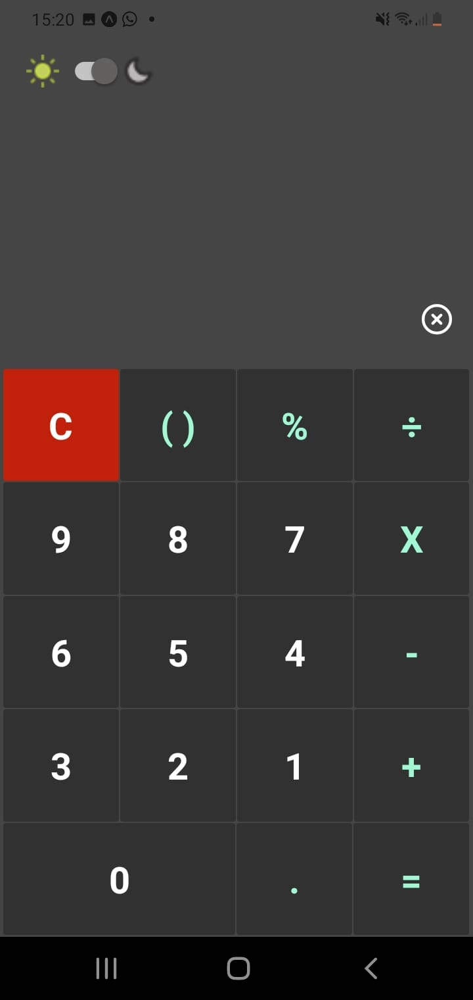

  <a href="#-tecnologias">Tecnologias</a>&nbsp;&nbsp;&nbsp;|&nbsp;&nbsp;&nbsp;
  <a href="#-projeto">Projeto</a>&nbsp;&nbsp;&nbsp;|&nbsp;&nbsp;&nbsp;
  <a href="#memo-licença">Licença</a>

 

    
  

## 🚀 Tecnologias

Esse projeto foi desenvolvido com as seguintes tecnologias:

- React native (expo)

Bibliotecas

- [styled-components](https://styled-components.com/)
- [typescript](https://www.typescriptlang.org/)

## 💻 Projeto

Criado para afins de estudo calculator é projeto que você pode fazer operações matematimaticas de forma simples e objetiva podendo mudar o tema para o modo normal ou dark.

## 📝 Licença

Esse projeto está sob a licença MIT. Veja o arquivo [LICENSE](.github/LICENSE.md) para mais detalhes.

---

Feito com ♥ by Mauricio Victor
